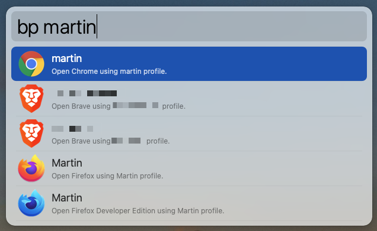

# Browsers Profiles for Alfred

> Open your browsers profiles from Alfred

## Installation

1. download latest version from [releases](https://github.com/skydiver/alfred-browsers-profiles/releases) section
2. open download `.alfredworkflow` file

## Usage

1. activate Alfred
2. type `bp` or `bp <your profile>`

## Supported Browsers

* Chrome
* Chromium
* Brave
* Edge
* Firefox

## Screenshot

## TODO

* Add support for other browsers
  * Orion: `open "/Users/karloguidoni/Applications/Orion/Orion Profiles/0A9FCDEF-C045-46DC-8D69-FC959804ABBD/Orion - fbds.rnv.app"`
* Sync my folder: /Users/karloguidoni/google-drive/kguidonimartins/alfred-macos-settings/Alfred.alfredpreferences/workflows/user.workflow.57C92BBB-8570-4136-B50C-E423952C4A4D
* Finish README
* Publish
